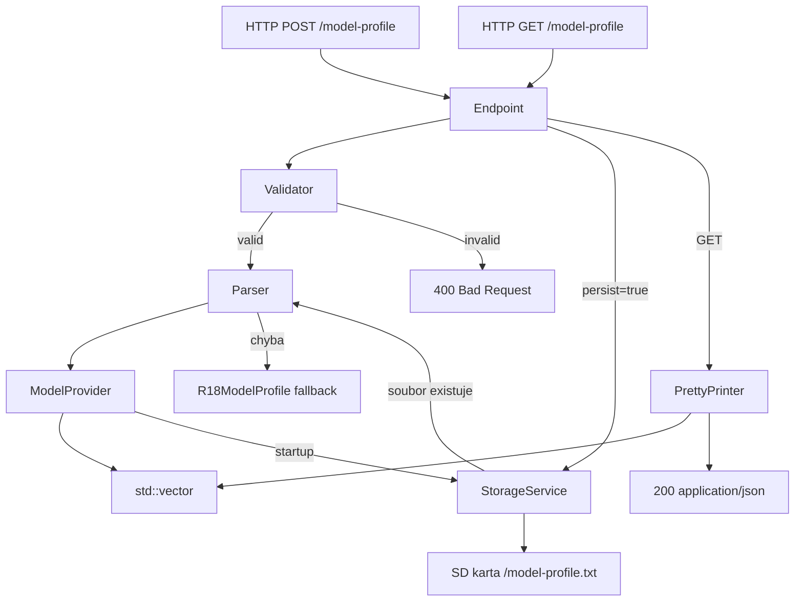

# Design Document: model-profile-upload

## Overview

Tato featura přidává dynamické nahrávání model profilů do ESP32 firmware REMv2 přes HTTP. Aktuálně je profil pevně zakódován v `R18ModelProfile.cpp`. Cílem je umožnit výměnu profilu za běhu přes HTTP POST na endpoint `/model-profile` s JSON tělem (Profile_JSON), bez nutnosti překompilovat firmware.

Featura zahrnuje:
- HTTP endpoint pro nahrání (POST) a čtení (GET) profilu
- Parser Profile_JSON → interní objekty (GroupBlock, BasicBlock podtřídy)
- Pretty-printer interních objektů → Profile_JSON
- Validátor struktury Profile_JSON
- Volitelnou persistenci profilu na SD kartě přes existující `StorageService`
- Rozšíření `ModelProvider` o načítání profilu ze SD karty při startu

Projekt používá PlatformIO, C++, `ESPAsyncWebServer` a `ArduinoJson` (dostupný přes PlatformIO registry).

---

## Architecture



Nové komponenty jsou záměrně odděleny od stávajícího kódu:
- `ProfileParser` a `ProfilePrettyPrinter` jsou čisté funkce bez závislosti na HTTP vrstvě
- `ProfileValidator` je volán před parserem a vrací chybový popis
- Endpoint handler v `main.cpp` orchestruje tok dat

---

## Components and Interfaces

### ProfileValidator

Validuje strukturu Profile_JSON před parsováním. Vrací `std::string` s popisem první nalezené chyby, nebo prázdný řetězec při úspěchu.

```cpp
// src/modelprofiles/ProfileValidator.hh
#pragma once
#include <string>
#include <ArduinoJson.h>

class ProfileValidator {
public:
    // Vrací "" při úspěchu, jinak popis chyby (včetně cesty k problematickému poli)
    static std::string validate(const JsonDocument& doc);
};
```

### ProfileParser

Parsuje validovaný `JsonDocument` na `std::vector<GroupBlock*>`. Při neznámém typu skupiny vrací prázdný vektor a nastavuje chybový výstup.

```cpp
// src/modelprofiles/ProfileParser.hh
#pragma once
#include <vector>
#include <string>
#include <ArduinoJson.h>
#include "../objects/GroupBlock.hh"

class ProfileParser {
public:
    // Vrací neprázdný vektor při úspěchu.
    // error je nastaven na "" při úspěchu, jinak na popis chyby.
    static std::vector<GroupBlock*> parse(const JsonDocument& doc, std::string& error);
};
```

### ProfilePrettyPrinter

Serializuje `std::vector<GroupBlock*>` zpět do Profile_JSON řetězce.

```cpp
// src/modelprofiles/ProfilePrettyPrinter.hh
#pragma once
#include <vector>
#include <string>
#include "../objects/GroupBlock.hh"

class ProfilePrettyPrinter {
public:
    static std::string serialize(const std::vector<GroupBlock*>& groups);
};
```

### ModelProvider (rozšíření)

`ModelProvider` je rozšířen o:
- Metodu `LoadFromJson(const std::string& json)` pro výměnu profilu za běhu
- Logiku v `LoadModel()` pro načtení ze SD karty při startu (s fallbackem na R18)

```cpp
// src/modelprofiles/modelprovider.hh (rozšíření)
class ModelProvider {
private:
    std::vector<GroupBlock*> Groups;
    ModelProfile* modelProfile;
    void freeGroups(); // uvolní paměť aktuálních skupin
public:
    ModelProvider();
    void LoadModel();
    std::vector<GroupBlock*> GetGroups();
    // Nová metoda: nahradí Groups skupinami parsovanými z json.
    // Vrací "" při úspěchu, jinak popis chyby.
    std::string LoadFromJson(const std::string& json);
};
```

### HTTP Endpoint (`/model-profile`)

Registrován v `main.cpp` vedle stávajících endpointů. Používá `AsyncWebServer` s body handlerem pro POST (nutné pro čtení těla požadavku v ESPAsyncWebServer).

**POST `/model-profile`**
- Čte tělo požadavku
- Volá `ProfileValidator::validate()` → při chybě vrátí 400
- Volá `modelProvider->LoadFromJson()` → při chybě vrátí 400
- Pokud `persist=true`, uloží JSON na SD kartu přes `StorageService`
- Vrátí 200 s textovým potvrzením

**GET `/model-profile`**
- Volá `ProfilePrettyPrinter::serialize(modelProvider->GetGroups())`
- Vrátí 200 s `Content-Type: application/json`

---

## Data Models

### Profile_JSON formát

```json
{
  "groups": [
    {
      "id": 0,
      "type": "controll",
      "blocks": [
        {
          "id": 0,
          "name": "Front Left",
          "pins": [32, 33]
        }
      ]
    },
    {
      "id": 2,
      "type": "action",
      "blocks": [
        {
          "id": 3,
          "name": "Action Right",
          "pins": [12, 14, 26, 27],
          "actionType": "LinearBlink"
        }
      ]
    },
    {
      "id": 5,
      "type": "slider",
      "blocks": [
        {
          "id": 5,
          "name": "Slider Red All",
          "pins": [0, 4, 2, 15, 32, 33]
        }
      ]
    },
    {
      "id": 6,
      "type": "inputSlider",
      "blocks": [
        {
          "id": 6,
          "name": "Input Slider Red All",
          "pins": [0, 4, 2, 15, 32, 33],
          "maxValue": 180
        }
      ]
    }
  ]
}
```

### Mapování typů skupin

| `type` v JSON  | `BlockTypeEnum` | Třída bloku       | Povinná extra pole |
|----------------|-----------------|-------------------|--------------------|
| `"controll"`   | `controll`      | `OnOffBlock`      | —                  |
| `"action"`     | `action`        | `ActionBlock`     | `actionType`       |
| `"slider"`     | `slider`        | `SliderBlock`     | —                  |
| `"inputSlider"`| `inputSlider`   | `InputSliderBlock`| `maxValue` (opt.)  |

### Mapování `actionType`

| `actionType` v JSON | Třída akce          |
|---------------------|---------------------|
| `"LinearBlink"`     | `LinearBlinkAction` |
| `"Blink"`           | `BlinkAction`       |
| `"RandomBlink"`     | `RandomBlinkAction` |

### Interní objekty (existující)

```
GroupBlock
  int id
  BlockTypeEnum type
  std::vector<BasicBlock*> blocks

BasicBlock (abstraktní)
  int id
  int blok_id
  std::vector<int> pins
  const char* name

OnOffBlock : BasicBlock
ActionBlock : BasicBlock
  Action* action
SliderBlock : BasicBlock
InputSliderBlock : BasicBlock
  int max_value
```

### Persistence na SD kartě

`StorageService` ukládá soubory jako `/<name>.txt`. Pro model profil bude použit název `model-profile`, tedy soubor `/model-profile.txt`. Metoda `appendToFile` přidává na konec — pro přepis profilu je nutné soubor nejprve smazat nebo použít `FILE_WRITE` místo `FILE_APPEND`. Toto bude řešeno přidáním metody `writeFile` do `StorageService`, nebo přímým voláním SD API v `ModelProvider`.

> Rozhodnutí: Přidáme metodu `writeFile(name, data)` do `StorageService` pro atomický přepis souboru, aby bylo chování konzistentní s existujícím API.

---


## Error Handling

| Situace | Chování |
|---|---|
| Prázdné nebo chybějící tělo POST | 400, `"Missing or empty body"` |
| Nevalidní JSON syntaxe | 400, popis chyby z ArduinoJson |
| Chybějící povinné pole ve struktuře | 400, popis z Validátoru s cestou |
| Neznámý typ skupiny | 400, `"Unknown group type: <type>"` |
| Neplatný actionType | 400, `"Unknown actionType: <type> at groups[N].blocks[M]"` |
| persist=true, SD nedostupná | 200, `"Profile applied in memory. SD write failed."` |
| Čtení profilu ze SD při startu selže | Fallback na R18ModelProfile, log přes Serial |
| Parsování profilu ze SD při startu selže | Fallback na R18ModelProfile, log přes Serial |

Paměťová správa: při výměně profilu v `ModelProvider::LoadFromJson()` musí být stávající `GroupBlock` objekty (a jejich `BasicBlock` potomci) uvolněny z heap před nahrazením. Metoda `freeGroups()` projde `Groups` a zavolá `delete` na každý blok i skupinu.

---


